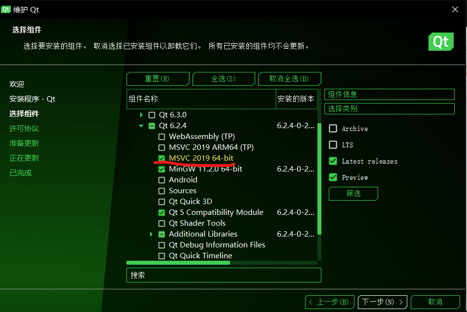

## 工程配置

### 使用 VS 进行开发

#### 设置 Qt 版本路径
如果默认使用 Qt Creator 进行开发毫无问题，但都已经使用 win 了不好好利用上 vs 实在是浪费。在 vs 中下载好对于的 qt 拓展插件后，extensions 中找到 qt tools，选择 msvs 版本的构建工具路径即可。



#### 构建 Qt 程序

**CMake 生成 VS 工程**
下载好 msvs 构建工具后，执行 `cmake ..` 默认通过 msvs 构建工具生成 vs 工程。

**VS 直接打开 CMake 工程**
VS - file - Open - CMake

**设置 Qt SDK 索引**

这里比较奇怪，如果我们使用的时 Qt Creator 进行开发，创建好工程后一路顺畅直接 build 即可，而且工程目录下也没有生成任何的冗余 IDE 相关文件，但生成 vs 工程后会多出大量的 vs IDE 相关的文件不说，此时直接跑 CMakeLists.txt 会提示需要添加 Qt6 目录。

`set(CMAKE_PREFIX_PATH your_qt_file_path/6.2.4/msvc2019_64)`

**自动补齐依赖**

自动补齐 Qt app 运行时依赖的 dll 动态库

`qt_file_path/bin/windeployqt.exe your_app_fila_path/apptest.exe`


等待一会儿后，对应的 `out` 目录下补齐了一堆缺失的动态库，此时就可以正常通过 vs IDE 来愉快的进行 Qt 开发了。


## CMake 自动索引文件

`file(GLOB_RECURSE sources *.cpp)`

### qt_add_qml_module
使用 qt6.2 新增的 qml module 管理 qml 时，需要注意 qml 文件路径，若直接通过给 `QML_FILES` 塞入 `file(GLOB_RECURSE )` 读取到的 qml 文件 list 变量，会因为路径问题报错，需要去除掉路径中的工程目录名前缀。

```cmake
file(GLOB_RECURSE qmls *.qml)

foreach(filepath ${qmls})
    string(REPLACE "${CMAKE_CURRENT_SOURCE_DIR}/" "" filename ${filepath})
    list(APPEND qml_files ${filename})
endforeach(filepath)

qt_add_qml_module(appImageEditor
    URI ImageEditor
    VERSION 1.0
    QML_FILES ${qml_files}
)
```

可参考[文章](https://zhuanlan.zhihu.com/p/488065537)。

